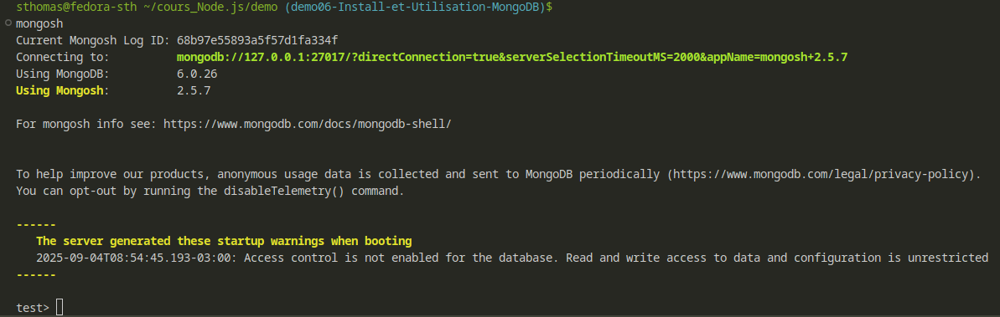

## Installation du projet
- git init
- npm init
- npm i express
- sudo dnf update
- sudo dnf install nodejs-nodemon
- nodemon app.js

## Mise en place d'un formulaire HTML
- npm i ejs

## Validation d'un formulaire
- npm i express-validator

## Install MongoDB sur Fedora

### 1 - Ajout du repo à dnf

- sudo nano /etc/yum.repos.d/mongodb-org-6.0.repo

>> [mongodb-org-6.0]
>> name=MongoDB Repository
>> baseurl=https://repo.mongodb.org/yum/redhat/9/mongodb-org/6.0/x86_64/
>> gpgcheck=1
>> enabled=1
>> gpgkey=https://www.mongodb.org/static/pgp/server-6.0.asc

### 2 - Installation
- sudo dnf update --refresh
- sudo dnf install mongodb-org

### 3 - Activation service
- sudo systemctl enable mongod.service
- sudo systemctl start mongod.service

- sudo systemctl status mongod.service

### 4 - Test connexion MongoDB

### A noter 
mongoDB déclenche des alertes de sécurité sur selinux. Pour les désactiver sans lever les permissions :
 > * #### Analyse les alertes et génère une politique :
>>>> ausearch -c "ftdc" --raw | audit2allow -M my-ftdc

> * #### Installe le module
>>>> semodule -X 300 -i my-ftdc.pp

### 5- Installation de mongoDB sur le projet

* npm i mongodb

### 6- Installation dépendance UUID
npm i uuid